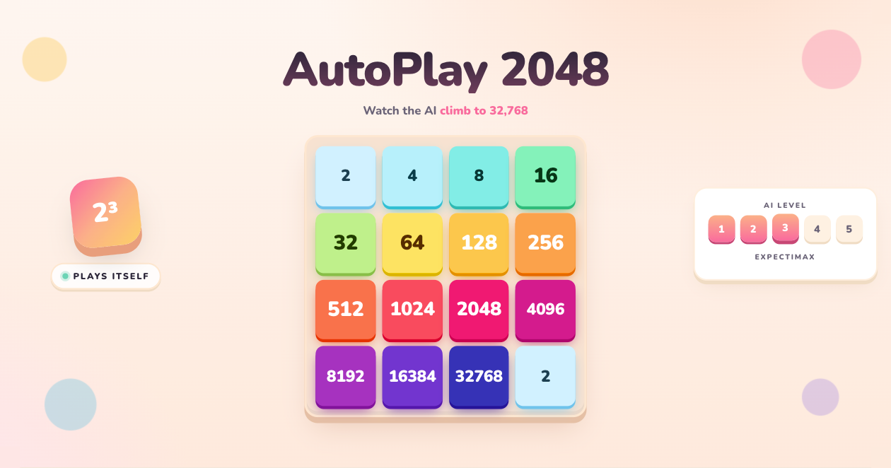

# AutoPlay 2048

A browser-only demo where a pre-trained N-Tuple Network agent plays 2048
on its own. The core ports the 4x6patt expectimax search from
[TDL2048+](https://github.com/moporgic/TDL2048) (MIT, Hung Guei 2021) to
WebAssembly via Emscripten.

**Live demo**: <https://autoplay2048.ponyo877.com/>

100-game bench at depth 3: **16384 reached in 94%, 32768 in 37%**.

## License

- The source code in this repository is **MIT**. The MIT License of every
  third-party artefact we redistribute is also reproduced in
  [`LICENSE`](./LICENSE).
- For per-artefact provenance and attribution, see [`NOTICE.md`](./NOTICE.md).
